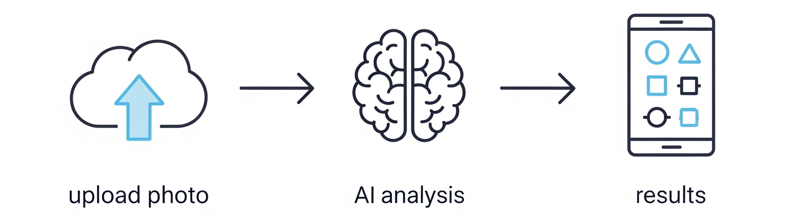

# Skyggle!-Cloud Identifier 🎯

## Basic Details
### Team Name: Ctrl + Alt

### Team Members
- Team Lead: Megha V Nair - VAST Thrissur
- Member 2: Sarathkumar K - VAST Thrissur

### Project Description
Skyggle! is a delightfully themed web application that identifies what shapes clouds look like using AI. Upload a cloud photo and discover if that fluffy formation resembles a dog, castle, or elephant - bringing back the childhood joy of cloud-gazing with modern AI magic!

### The Problem (that doesn't exist)
People have lost the ancient art of cloud-gazing and need AI to tell them what obvious shapes they're looking at in the sky! Gone are the days when humans could look up and say "that cloud looks like a bunny" - now we need artificial intelligence to point out the obvious.

### The Solution (that nobody asked for)
Skyggle! uses Google's Gemini AI to analyze cloud photos and tell you exactly what shapes those clouds resemble. Complete with an atmospheric cloud-filled interface that makes you feel like you're floating in the sky while getting AI insights about... clouds. Because why trust your imagination when you can trust a robot?

## Technical Details
### Technologies/Components Used
For Software:
- **Languages**: HTML5, CSS3, JavaScript (ES6+)
- **API**: Google Gemini AI API for cloud shape recognition
- **Styling**: CSS animations, Flexbox, backdrop filters, responsive design
- **Fonts**: Google Fonts (Inter & Quicksand for that airy feel)

### Implementation
For Software:
# Installation
1. Clone the repository
2. Get your Google Gemini API key from [Google AI Studio](https://makersuite.google.com/app/apikey)
3. Set up your API key in script.js:
4. Ensure all files (index.html, styles.css, script.js) are in the same directory

# Run
- Use LiveServer Plugin in VS Code for local development
- Or open index.html directly in any modern web browser
- For deployment: Upload to GitHub Pages or any static hosting service

# Screenshots (Add at least 3)

*The main Skyggle! interface with 8 animated clouds floating across a gradient sky*

*User uploading a photo of clouds with drag-and-drop functionality*

*Gemini AI identifying cloud shapes: "This cloud formation resembles a majestic dragon soaring through the sky"*

# Diagrams

*User uploads cloud photo → Gemini AI analyzes → Shape identification results displayed with floating animations*

### Project Demo
# Video
<video width="700" controls>
  <source src="images/vid.webm" type="video/webm">
</video>

---
Made with ❤️ at TinkerHub Useless Projects 

